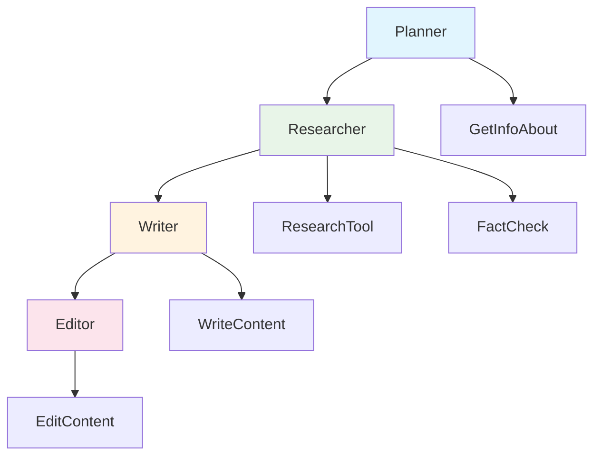

# AgentEval CLI Reference

The AgentEval CLI provides command-line tools for running evaluations and managing configurations in CI/CD pipelines.

## Installation

```bash
# Install as a global .NET tool
dotnet tool install -g AgentEval.Cli

# Or install locally in your project
dotnet tool install AgentEval.Cli
```

## Commands

### eval

Run evaluations against an AI agent.

```bash
agenteval eval [options]
```

**Options:**

| Option | Alias | Description | Default |
|--------|-------|-------------|---------|
| `--config <path>` | `-c` | Path to evaluation configuration file (YAML or JSON) | - |
| `--dataset <path>` | `-d` | Path to dataset file (JSON, JSONL, CSV, YAML) | - |
| `--output <path>` | `-o` | Output file path for results | stdout |
| `--format <format>` | `-f` | Output format (json, junit, markdown, trx) | json |
| `--baseline <path>` | `-b` | Baseline file for regression comparison | - |
| `--fail-on-regression` | | Exit with code 1 if regressions detected | false |
| `--pass-threshold <n>` | | Minimum score to pass (0-100) | 70 |

**Examples:**

```bash
# Run evaluation with JSON dataset
agenteval eval --dataset testcases.json --format junit --output results.xml

# Run with config file and YAML dataset
agenteval eval --config agent-config.json --dataset cases.yaml --format markdown

# Set custom pass threshold
agenteval eval --dataset data.jsonl --pass-threshold 80

# Compare against baseline
agenteval eval --dataset tests.json --baseline baseline.json --fail-on-regression
```

### init

Create a starter evaluation configuration file.

```bash
agenteval init [options]
```

**Options:**

| Option | Alias | Description | Default |
|--------|-------|-------------|---------|
| `--output <path>` | `-o` | Output path for configuration file | agenteval.json |
| `--format <format>` | `-f` | Configuration format (json, yaml) | json |

**Examples:**

```bash
# Create JSON configuration
agenteval init

# Create YAML configuration
agenteval init --format yaml --output agenteval.yaml
```

### list

List available metrics, assertions, and formats.

```bash
agenteval list <subcommand>
```

**Subcommands:**

| Subcommand | Description |
|------------|-------------|
| `metrics` | List all available evaluation metrics |
| `assertions` | List all available assertion types |
| `formats` | List available output formats |

**Examples:**

```bash
# List available metrics
agenteval list metrics

# List assertion types
agenteval list assertions

# List output formats
agenteval list formats
```

---

## Workflow Evaluation Commands

### workflow-eval

Run evaluations against multi-agent workflows.

```bash
agenteval workflow-eval [options]
```

**Options:**

| Option | Alias | Description | Default |
|--------|-------|-------------|---------|
| `--config <path>` | `-c` | Path to workflow evaluation configuration file | - |
| `--dataset <path>` | `-d` | Path to workflow test cases file | - |
| `--output <path>` | `-o` | Output file path for results | stdout |
| `--format <format>` | `-f` | Output format (json, junit, markdown, mermaid) | json |
| `--timeout <seconds>` | `-t` | Global workflow timeout in seconds | 300 |
| `--executor-timeout <seconds>` | | Per-executor timeout in seconds | 120 |
| `--export-graph` | | Export workflow graph visualization | false |
| `--fail-on-executor-error` | | Fail entire workflow if any executor fails | true |

**Examples:**

```bash
# Run workflow evaluation with configuration
agenteval workflow-eval --config workflow-config.yaml --dataset workflow-tests.json

# Export with graph visualization 
agenteval workflow-eval --dataset tests.jsonl --export-graph --format mermaid --output results.md

# Custom timeouts for long workflows
agenteval workflow-eval --dataset workflows.yaml --timeout 600 --executor-timeout 180
```

### workflow-init

Create a starter workflow evaluation configuration.

```bash
agenteval workflow-init [options]
```

**Options:**

| Option | Alias | Description | Default |
|--------|-------|-------------|---------|
| `--output <path>` | `-o` | Output path for configuration file | workflow-config.json |
| `--format <format>` | `-f` | Configuration format (json, yaml) | json |
| `--template <type>` | `-t` | Workflow template (sequential, parallel, conditional) | sequential |

**Examples:**

```bash
# Create sequential workflow config
agenteval workflow-init --template sequential

# Create YAML configuration for parallel workflow
agenteval workflow-init --format yaml --template parallel --output parallel-config.yaml
```

### workflow-validate

Validate workflow configuration and graph structure.

```bash
agenteval workflow-validate [options]
```

**Options:**

| Option | Alias | Description | Default |
|--------|-------|-------------|---------|
| `--config <path>` | `-c` | Path to workflow configuration file | - |
| `--verbose` | `-v` | Show detailed validation results | false |
| `--check-agents` | | Validate agent binding availability | false |

**Examples:**

```bash
# Validate workflow configuration
agenteval workflow-validate --config workflow-config.yaml

# Detailed validation with agent checking
agenteval workflow-validate --config config.json --verbose --check-agents
```

---

## Dataset Formats

The CLI supports multiple dataset formats for loading test cases.

### JSON

```json
[
  {
    "name": "Test Case 1",
    "input": "What is the weather?",
    "expectedOutput": "The weather is sunny",
    "context": ["Weather data: sunny, 72°F"]
  }
]
```

### JSONL (JSON Lines)

```jsonl
{"name": "Test 1", "input": "Hello", "expectedOutput": "Hi there!"}
{"name": "Test 2", "input": "Goodbye", "expectedOutput": "See you later!"}
```

### CSV

```csv
name,input,expectedOutput,context
Test 1,What is 2+2?,4,
Test 2,Capital of France?,Paris,Geography data
```

### YAML

```yaml
- name: Test Case 1
  input: What is the weather?
  expectedOutput: The weather is sunny
  context:
    - "Weather data: sunny, 72°F"

- name: Test Case 2
  input: Book a flight
  expectedOutput: Flight booked successfully
  expectedTools:
    - FlightSearch
    - BookFlight
```

### Workflow Test Cases (JSON)

Workflow-specific test case format for multi-agent evaluations:

```json
[
  {
    "name": "Content Creation Pipeline",
    "input": "Write an article about sustainable technology",
    "agents": ["Planner", "Researcher", "Writer", "Editor"],
    "expectedExecutionOrder": ["Planner", "Researcher", "Writer", "Editor"],
    "timeoutPerAgent": "00:02:00",
    "workflowTimeout": "00:10:00",
    "expectedTools": ["ResearchTool", "FactCheck"],
    "passingCriteria": {
      "minExecutorSuccessRate": 0.8,
      "maxTotalCost": 0.50,
      "requiredOutputLength": 500
    }
  },
  {
    "name": "Travel Booking Workflow", 
    "input": "Plan a trip to Paris for next weekend",
    "agents": ["TripPlanner", "FlightReservation"],
    "expectedToolChain": [
      {"tool": "GetInfoAbout", "executor": "TripPlanner"},
      {"tool": "SearchFlights", "executor": "FlightReservation"},
      {"tool": "BookFlight", "executor": "FlightReservation", "after": "SearchFlights"}
    ],
    "workflowTimeout": "00:05:00"
  }
]
```

### Workflow Configuration (YAML)

Configuration for workflow evaluation settings:

```yaml
workflow:
  name: "ContentCreationPipeline"
  timeout: "00:10:00"
  
agents:
  - id: "Planner"
    name: "ContentPlannerAgent"
    timeout: "00:02:00"
    
  - id: "Researcher" 
    name: "ResearchAgent"
    timeout: "00:03:00"
    tools: ["ResearchTool", "FactCheck"]
    
  - id: "Writer"
    name: "ContentWriterAgent" 
    timeout: "00:03:00"
    
  - id: "Editor"
    name: "EditorAgent"
    timeout: "00:02:00"

execution:
  order: ["Planner", "Researcher", "Writer", "Editor"]
  failOnError: true
  streaming: true

evaluation:
  metrics:
    - "code_workflow_structure_validity"
    - "code_workflow_execution_order" 
    - "llm_workflow_output_quality"
  
  assertions:
    - type: "HaveStepCount"
      expected: 4
    - type: "HaveExecutedInOrder" 
      order: ["Planner", "Researcher", "Writer", "Editor"]
    - type: "HaveCompletedWithin"
      duration: "00:10:00"

export:
  includeGraph: true
  includePerExecutorResults: true
  format: "markdown"

### JSON

```json
{
  "summary": {
    "total": 10,
    "passed": 8,
    "failed": 2,
    "duration": "00:00:15.234"
  },
  "results": [...]
}
```

### JUnit XML

Compatible with CI systems like GitHub Actions, Azure DevOps, Jenkins.

```xml
<?xml version="1.0" encoding="utf-8"?>
<testsuites>
  <testsuite name="AgentEval" tests="10" failures="2" time="15.234">
    <testcase name="Test Case 1" time="1.234" />
    <testcase name="Test Case 2" time="2.345">
      <failure message="Expected output mismatch">...</failure>
    </testcase>
  </testsuite>
</testsuites>
```

### Markdown

```markdown
# Evaluation Results

| Test Case | Status | Duration | Score |
|-----------|--------|----------|-------|
| Test 1 | ✅ Pass | 1.23s | 95% |
| Test 2 | ❌ Fail | 2.34s | 45% |

## Summary
- **Total:** 10
- **Passed:** 8
- **Failed:** 2
```

### Workflow Output Formats

#### Mermaid (Workflow Graphs)

Visual workflow execution graphs for documentation:



#### Workflow JSON Results

```json
{
  "workflowName": "ContentCreationPipeline",
  "summary": {
    "totalExecutors": 4,
    "successfulExecutors": 4,
    "failedExecutors": 0,
    "totalDuration": "00:08:45.123",
    "totalCost": 0.42,
    "overallScore": 92.5
  },
  "executorResults": {
    "Planner": {
      "status": "Success",
      "duration": "00:01:23.456",
      "cost": 0.05,
      "toolUsage": [{"tool": "GetInfoAbout", "calls": 2}]
    },
    "Researcher": {
      "status": "Success", 
      "duration": "00:02:34.567",
      "cost": 0.12,
      "toolUsage": [
        {"tool": "ResearchTool", "calls": 3},
        {"tool": "FactCheck", "calls": 1}
      ]
    }
  },
  "graphVisualization": "mermaid://...",
  "assertions": {
    "HaveStepCount": {"expected": 4, "actual": 4, "passed": true},
    "HaveExecutedInOrder": {"passed": true}
  }
}
```

## CI/CD Integration

### GitHub Actions

```yaml
name: Agent Evaluation

on: [push, pull_request]

jobs:
  test:
    runs-on: ubuntu-latest
    steps:
      - uses: actions/checkout@v4
      
      - name: Setup .NET
        uses: actions/setup-dotnet@v4
        with:
          dotnet-version: '8.0.x'
      
      - name: Install AgentEval CLI
        run: dotnet tool install -g AgentEval.Cli
      
      - name: Run Evaluation
        run: agenteval eval --dataset tests/cases.jsonl --format junit --output results.xml
      
      - name: Publish Results
        uses: dorny/test-reporter@v1
        if: always()
        with:
          name: Agent Tests
          path: results.xml
          reporter: java-junit
```

### Azure DevOps

```yaml
trigger:
  - main

pool:
  vmImage: 'ubuntu-latest'

steps:
  - task: UseDotNet@2
    inputs:
      version: '8.0.x'

  - script: dotnet tool install -g AgentEval.Cli
    displayName: 'Install AgentEval CLI'

  - script: agenteval eval --dataset tests/cases.jsonl --format junit --output $(Build.ArtifactStagingDirectory)/results.xml
    displayName: 'Run Evaluation'

  - task: PublishTestResults@2
    inputs:
      testResultsFormat: 'JUnit'
      testResultsFiles: '$(Build.ArtifactStagingDirectory)/results.xml'
```

### Workflow CI/CD Integration

#### GitHub Actions (Workflow Evaluation)

```yaml
name: Multi-Agent Workflow Evaluation

on: [push, pull_request]

jobs:
  workflow-test:
    runs-on: ubuntu-latest
    steps:
      - uses: actions/checkout@v4
      
      - name: Setup .NET
        uses: actions/setup-dotnet@v4
        with:
          dotnet-version: '8.0.x'
      
      - name: Install AgentEval CLI
        run: dotnet tool install -g AgentEval.Cli
      
      - name: Run Workflow Evaluation
        run: |
          agenteval workflow-eval \
            --dataset tests/workflow-cases.json \
            --config tests/workflow-config.yaml \
            --format junit \
            --output workflow-results.xml \
            --export-graph
        env:
          AZURE_OPENAI_ENDPOINT: ${{ secrets.AZURE_OPENAI_ENDPOINT }}
          AZURE_OPENAI_API_KEY: ${{ secrets.AZURE_OPENAI_API_KEY }}
      
      - name: Publish Workflow Results
        uses: dorny/test-reporter@v1
        if: always()
        with:
          name: Workflow Tests
          path: workflow-results.xml
          reporter: java-junit
          
      - name: Upload Workflow Graphs
        uses: actions/upload-artifact@v4
        if: always()
        with:
          name: workflow-graphs
          path: "**/*.mmd"
```

## Programmatic Usage

You can also use the exporters and loaders programmatically from the main AgentEval library:

```csharp
using AgentEval.DataLoaders;
using AgentEval.Exporters;

// Load test cases from various formats
var jsonlLoader = DatasetLoaderFactory.CreateFromExtension(".jsonl");
var testCases = await jsonlLoader.LoadAsync("testcases.jsonl");

// Or create by format name
var yamlLoader = DatasetLoaderFactory.Create("yaml");
var yamlCases = await yamlLoader.LoadAsync("testcases.yaml");

// Export results to various formats
var report = new EvaluationReport { /* ... */ };
var exporter = ResultExporterFactory.Create(ExportFormat.JUnit);
await exporter.ExportAsync(report, "results.xml");

// Register custom loaders
DatasetLoaderFactory.Register(".custom", () => new JsonlDatasetLoader());
```

## See Also

- [Workflows](workflows.md) - Multi-agent workflow evaluation guide
- [Benchmarks](benchmarks.md) - Running performance benchmarks
- [Conversations](conversations.md) - Multi-turn evaluation
- [Extensibility](extensibility.md) - Custom exporters and loaders
