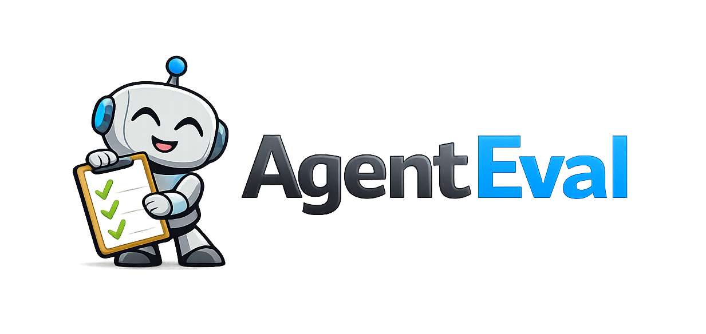

# AgentEval

<p align="center">
  
</p>

<p align="center">
  <strong>Your AI agent works great... until it doesn't.<br/>AgentEval catches the failures before your users do.</strong>
</p>

<p align="center">
  <a href="https://www.nuget.org/packages/AgentEval">
    
  </a>
  
</p>

---

## The .NET Evaluation Toolkit for AI Agents

AgentEval is **the comprehensive .NET toolkit for AI agent evaluation**—tool usage validation, RAG quality metrics, stochastic evaluation, and model comparison—built for **Microsoft Agent Framework (MAF)**. What RAGAS and DeepEval do for Python, AgentEval does for .NET.

> **For years, agentic developers have imagined writing evaluations like this. Today, they can.**

---

## The Code You've Been Dreaming Of

### Assert on Tool Chains Like Requirements

```csharp
result.ToolUsage!.Should()
    .HaveCalledTool("AuthenticateUser", because: "security first")
        .BeforeTool("FetchUserData")
        .WithArgument("method", "OAuth2")
    .And()
    .HaveCalledTool("SendNotification")
        .AtLeastTimes(1)
    .And()
    .HaveNoErrors();
```

**No more regex parsing logs. No more "did it call that function?"**

### Performance SLAs as Executable Evaluations

```csharp
result.Performance!.Should()
    .HaveFirstTokenUnder(TimeSpan.FromMilliseconds(500),
        because: "streaming responsiveness matters")
    .HaveTotalDurationUnder(TimeSpan.FromSeconds(5))
    .HaveEstimatedCostUnder(0.05m,
        because: "stay within budget");
```

**Know before production if your agent is too slow or too expensive.**

### stochastic evaluation: Because LLMs Aren't Deterministic

```csharp
var result = await stochasticRunner.RunStochasticTestAsync(
    agent, testCase,
    new StochasticOptions(Runs: 10, SuccessRateThreshold: 0.85));

result.Statistics.SuccessRate.Should().BeGreaterThan(0.85);
result.Statistics.StandardDeviation.Should().BeLessThan(10);
```

**Run the same evaluation 10 times. Know your actual success rate, not your lucky-run rate.**

### Compare Models, Get a Winner

```csharp
var result = await comparer.CompareModelsAsync(
    factories: new[] { gpt4o, gpt4oMini, claude },
    testCases: testSuite,
    metrics: new[] { new ToolSuccessMetric(), new RelevanceMetric(eval) },
    options: new ComparisonOptions(RunsPerModel: 5));

Console.WriteLine(result.ToMarkdown());
```

**Output:**
```markdown
| Rank | Model         | Tool Accuracy | Relevance | Cost/1K Req |
|------|---------------|---------------|-----------|-------------|
| 🥇   | GPT-4o        | 94.2%         | 91.5      | $0.0150     |
| 🥈   | GPT-4o Mini   | 87.5%         | 84.2      | $0.0003     |

**Recommendation:** GPT-4o - Highest accuracy
**Best Value:** GPT-4o Mini - 87.5% accuracy at 50x lower cost
```

### Record Once, Replay Forever (No API Costs)

```csharp
// RECORD once (live API call)
var recorder = new TraceRecordingAgent(realAgent);
await recorder.ExecuteAsync("Book a flight to Paris");
TraceSerializer.Save(recorder.GetTrace(), "booking-trace.json");

// REPLAY forever (no API call, instant, free)
var replayer = new TraceReplayingAgent(trace);
var response = await replayer.ReplayNextAsync();  // Identical every time
```

**Save API costs. Run evaluations in CI. Get consistent results.**

---

## Red Team Security Evaluation

**Is your AI agent secure?** AgentEval's Red Team module evaluates against **192 attack probes** covering **6 OWASP LLM Top 10 vulnerabilities** (60% coverage) with **MITRE ATLAS** technique mapping.

```csharp
// One-line security scan
var result = await agent.QuickRedTeamScanAsync();

Console.WriteLine($"Security Score: {result.OverallScore}%");
Console.WriteLine($"Verdict: {result.Verdict}");

// Use with fluent assertions
result.Should()
    .HavePassed()
    .And()
    .HaveMinimumScore(80);
```

**Attack types included:** Prompt Injection, Jailbreaks, PII Leakage, System Prompt Extraction, Indirect Injection, Excessive Agency, Insecure Output Handling, API Abuse, Encoding Evasion.

```csharp
// Advanced: Full pipeline control
var result = await AttackPipeline
    .Create()
    .WithAttack(Attack.PromptInjection)
    .WithAttack(Attack.Jailbreak)
    .WithAttack(Attack.PIILeakage)
    .WithIntensity(Intensity.Comprehensive)
    .ScanAsync(agent);

// Export compliance reports
await result.ExportAsync("security-report.pdf", ExportFormat.Pdf);
```

[Red Team Evaluation →](redteam.md)

---

## Why AgentEval?

| Challenge | How AgentEval Solves It |
|-----------|------------------------|
| "What tools did my agent call?" | **Full tool timeline** with arguments, results, timing |
| "Evaluations fail randomly!" | **stochastic evaluation** - assert on pass *rate*, not single run |
| "Which model should I use?" | **Model comparison** with cost/quality recommendations |
| "Is my agent compliant?" | **Behavioral policies** - guardrails as code |
| "Is my agent secure?" | **Red team evaluation** - 192 OWASP LLM 2025 security probes |
| "Is content safe/unbiased?" | **ResponsibleAI metrics** - toxicity, bias, misinformation |
| "Is my RAG hallucinating?" | **Faithfulness metrics** - grounding verification |
| "How do I debug CI failures?" | **Trace replay** - capture and reproduce executions |

---

## Feature Highlights

<div class="grid cards" markdown>

-   **🎯 Fluent Assertions**
    
    Tool chains, performance, responses - all with `Should()` syntax

-   **⚡ Performance Metrics**
    
    TTFT, latency, tokens, cost estimation with 8+ model pricing

-   **🔬 stochastic evaluation**
    
    Run N times, get statistics, assert on pass rates

-   **🤖 Model Comparison**
    
    Compare models side-by-side with recommendations

-   **🎬 Trace Record/Replay**
    
    Deterministic evaluations without API calls

-   **🛡️ Behavioral Policies**
    
    NeverCallTool, MustConfirmBefore, PII detection

-   **🔴 Red Team Security**
    
    192 probes, 9 attack types, 60% OWASP LLM 2025 coverage, MITRE ATLAS mapping

-   **🛡️ Responsible AI**
    
    Toxicity detection, bias measurement, misinformation risk

-   **📊 RAG Metrics**
    
    Faithfulness, Relevance, Context Precision/Recall

-   **🔄 Multi-Turn Evaluation**
    
    Full conversation flow evaluation

</div>

---

## Who Is AgentEval For?

### 🏢 .NET Teams Building AI Agents

If you're building production AI agents in .NET and need to verify tool usage, enforce SLAs, handle non-determinism, or compare models—AgentEval is for you.

### 🚀 Microsoft Agent Framework (MAF) Developers

Native integration with MAF concepts: `AIAgent`, `IChatClient`, automatic tool call tracking, and performance metrics with token usage and cost estimation.

### 📊 ML Engineers Evaluating LLM Quality

Rigorous evaluation capabilities: RAG metrics (Faithfulness, Relevance, Context Precision), embedding-based similarity, and calibrated judge patterns for consistent evaluation.

---

## CLI Tool & Samples

**CLI for CI/CD:**
```bash
dotnet tool install -g AgentEval.Cli
agenteval eval --dataset tests.yaml --format junit -o results.xml
```

**Detailed samples** included—from Hello World to Red Team Security. [View Samples →](https://github.com/joslat/AgentEval/tree/main/samples/AgentEval.Samples)

---

## Documentation

| Getting Started | Features | Advanced |
|-----------------|----------|----------|
| [Installation](installation.md) | [Assertions](assertions.md) | [stochastic evaluation](stochastic-evaluation.md) |
| [Quick Start](getting-started.md) | [Red Team Security](redteam.md) | [Model Comparison](model-comparison.md) |
|  | [Responsible AI](ResponsibleAI.md) |  |
| [Walkthrough](walkthrough.md) | [Metrics Reference](metrics-reference.md) | [Trace Record/Replay](tracing.md) |
| [CLI Tool](cli.md) | [Benchmarks](benchmarks.md) | [Architecture](architecture.md) |
|  | [Workflows](workflows.md) |  |

---

## The .NET Advantage

| Feature | AgentEval | Python Alternatives |
|---------|-----------|---------------------|
| **Language** | Native C#/.NET | Python only |
| **Type Safety** | Compile-time errors | Runtime exceptions |
| **IDE Support** | Full IntelliSense | Variable |
| **MAF Integration** | First-class | None |
| **Fluent Assertions** | `Should().HaveCalledTool()` | N/A |
| **Trace Replay** | Built-in | Manual |

---

## Test Coverage

AgentEval maintains a **comprehensive test suite** running across **multiple target frameworks**, ensuring reliability.

[](https://codecov.io/gh/joslat/AgentEval)

---

## Community

- **GitHub:** [github.com/joslat/AgentEval](https://github.com/joslat/AgentEval)
- **NuGet:** [nuget.org/packages/AgentEval](https://www.nuget.org/packages/AgentEval)
- **Issues:** [Report bugs or request features](https://github.com/joslat/AgentEval/issues)
- **Discussions:** [Ask questions](https://github.com/joslat/AgentEval/discussions)

---

## Forever Open Source

AgentEval is **MIT licensed** and will remain open source forever.

- ✅ **No license changes** - MIT today, MIT forever
- ✅ **No "open core"** - All features are open source
- ✅ **Community first** - Built for the .NET AI community

---

<p align="center">
  <strong>Stop guessing if your AI agent works. Start proving it.</strong>
</p>

<p align="center">
  <a href="getting-started.md"><strong>Get Started →</strong></a>
</p>
